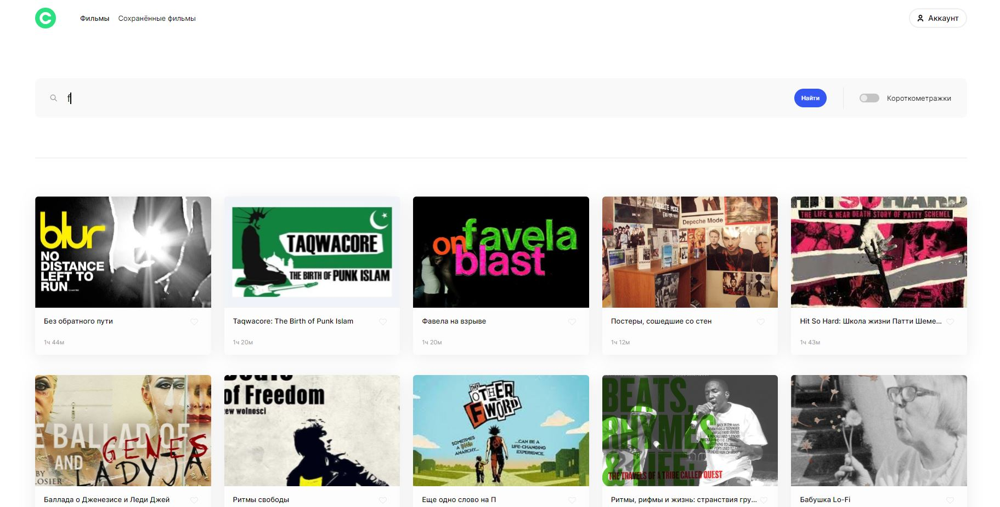

# Movies ### *(movies-explorer-frontend)*

Frontend дипломного проекта [Я.Практикум](https://practicum.yandex.ru) - cервиса, в котором можно найти фильмы по запросу и сохранить их в личном кабинете.  

Главная страница сайта - это лендинг-портфолио с информацией о проекте и его разработчике. С нее можно перейти на сервис поиска фильмов.

## Функциональность:

* Защищённость роутов (нельзя перейти к приложению-поисковику, если не выполнен вход в приложение)  
* Реализована "живая" __валидация__ всех форм/полей ввода с использованием регулярных выражений и сторонних библиотек  
* Использование собственных __хуков__ (универсальный обработчик полей, валидация, контроль разрешения экрана, закрытие попапов, фильтрация фильмов)  
* Сохранение/удаление найденных фильмов к себе в аккаунт  
* Реализован __фильтр__ короткометражных фильмов  
* Запоминание состояния полей ввода (в форме поиска фильмов), фильтра и найденных фильмов (при обновлении страницы данные не будут утеряны)  
* Поиск фильмов как на русском, так и английском языке  
* Реализован __попап__ для демонстрации ошибок сервера или некорректных введённых данных  
* При загрузке данных показывается __прелоадер__. По окончанию загрузки он скрывается  
* Полноценый __респонсив__ для всех популярных разрешений экрана  
* Бургерное меню для мобильной и планшетной версии  
* Реализовано закрытие попапа и бургерного меню по __оверлею__ или по клавише __Esc__  
* Переход к показу трейлера фильма при нажатии на постер  
* Все нужные кнопки подсвечиваются __outline__, им привязанно невидимое, но слышимое описание, для людей с __ограниченными__ возможностями  
* Приложение свёрстано по __БЭМ__, соблюдается __семантичность__  
* На странице поиска фильмов по клику на кнопку __"Ещё"__ - показываются дополнительные фильмы (на роуте с сохранёнными фильмами показываются сразу __все__ фильмы)  
* Утилитарные функции, константы, функции обращения к серверу вынесены в отдельный файл  
* Запросы к серверу написанны с использованием парадигмы __ООП__  
* Возможность редактирования своего профиля (почты и имени)  
* Запоминание состояния входа пользователя (при обновлении страницы будет выполнен автоматический вход)  
* Реализована __микроанимация__ всех ссылок и кнопок  
* Для создания сеток используется __flex__ и __grid__  
* Все данные хранятся на сервере, использовано сторонее и собственное API  

## Планы по доработке:
1. Реализовать показ данных о фильме при наведении курсора на постер

## Используемые технологии:

__Верстка:__
* HTML5, CSS3  
* БЭМ  
* Адаптивная верстка  
* Flexbox, grid  
* PixelPerfet  

__Функциональность на React и JavaScript:__
* JavaScript  
* Валидация форм на стороне клиента  
* Работа с API  
* Работа с DOM  
* React Router v6  

__Серверная часть:__
* Валидация запросов на стороне сервера  
* MongoDB  
* Express.js  
* joi, celebrate  

__Вспомогательные технологии:__
* Регулярные выражения  
* ESLint  

## Ссылки на проект:

1. IP 158.160.50.130  
2. [Frontend](https://diplom.akunstman.nomoredomains.xyz)  
3. [Backend](https://api.diplom.akunstman.nomoredomains.xyz)  
4. [Макет](https://disk.yandex.ru/d/zi5qEToXWYMvcQ)  